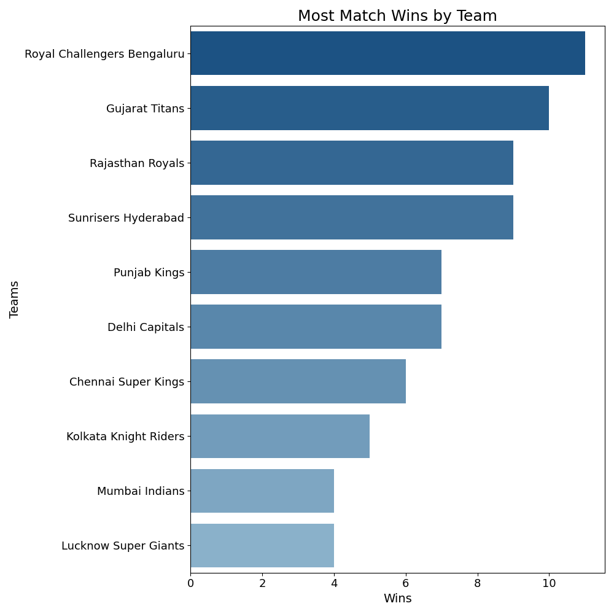
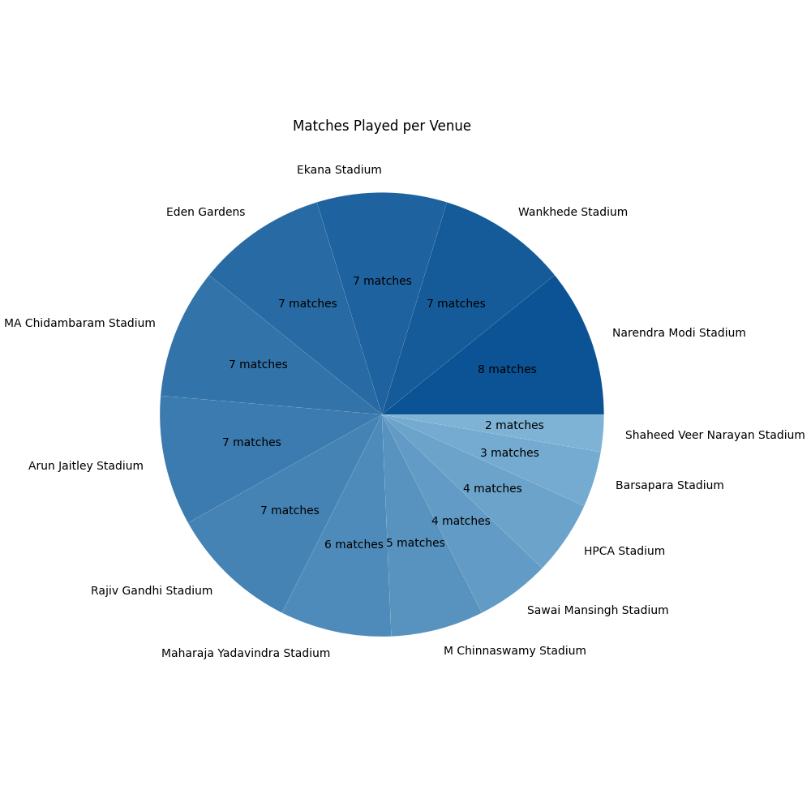
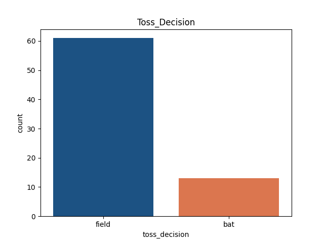
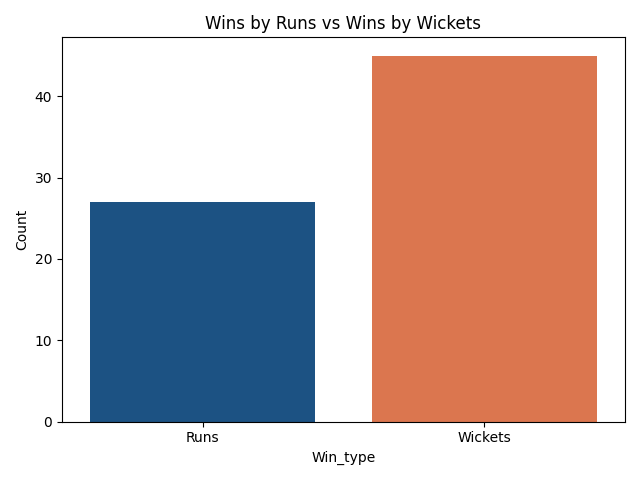
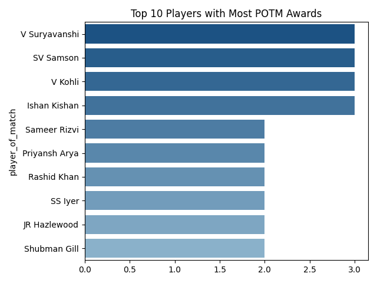

# IPL 2026 Data Analysis 🏏

A data analysis project exploring match-level trends from the IPL 2026 season — built as a capstone project to apply NumPy, pandas, Matplotlib, and seaborn on a real-world dataset.

## 📌 Overview

This project analyzes 74 IPL 2026 matches to explore season-wide trends in team performance, toss behavior, and venue distribution.

🏆 **The defending champions, Royal Challengers Bengaluru, are the IPL 2026 champions** — defeating Gujarat Titans in the final to win back-to-back titles! 🎉 And that dominance shows up in the league-stage numbers too, where RCB also leads the season in total match wins.

Questions explored in this analysis:
- Which team won the most matches this season?
- Does winning the toss actually predict winning the match?
- Do teams prefer batting or fielding first after winning the toss?
- How many matches in the season ended by defending a total (runs) vs. chasing it down (wickets)?
- Who won the most Player of the Match awards?
- Which venues hosted the most matches?

## 📊 Key Findings

- 🏆 **Royal Challengers Bengaluru** topped the league stage with the most match wins this season — **11 wins** — going on to lift the IPL 2026 trophy itself.
- Toss winners went on to win the match exactly **50% of the time** — suggesting the toss has far less predictive power over match outcomes than commentary often implies.
- Teams chose to **field first after winning the toss in 61 of 74 matches (82%)** — a strong preference for chasing this season.
- **45 of 72 decided matches were won by chasing (wickets)** vs. **27 won by defending a total (runs)** — across the season, more matches ended with the chasing team finishing the game than with the defending team bowling the opposition out or running down the overs.
- **V Suryavanshi, SV Samson, and V Kohli** tied for the most Player of the Match awards, with 3 each.
- **Narendra Modi Stadium, Ahmedabad** hosted the most matches (8), followed closely by Wankhede Stadium and Ekana Stadium (7 each).

## 🛠️ Tools Used

- **Python**
- **pandas** — data cleaning and aggregation
- **NumPy** — numerical operations
- **Matplotlib** — chart rendering
- **seaborn** — statistical visualizations and color palettes

## Files & Setup

`IPL_Data_Analysis.py` reads `IPL_2026.csv` and generates all five charts below as PNG files.

```bash
pip install pandas numpy matplotlib seaborn
python IPL_Data_Analysis.py
```

## 📈 Sample Visuals

All charts use a consistent navy blue (`#0B5394`) and coral (`#F26B38`) theme.

| Most Match Wins by Team | Matches Played per Venue |
|---|---|
|  |  |

| Toss Decision | Wins by Runs vs Wickets |
|---|---|
|  |  |

| Top 10 Players with Most POTM Awards |
|---|
|  |

## About

This project was built as a capstone project to practice end-to-end data analysis: data cleaning, exploratory analysis, and visual storytelling using a real-world sports dataset.

Dataset sourced from Kaggle (IPL 2026 season match data).
